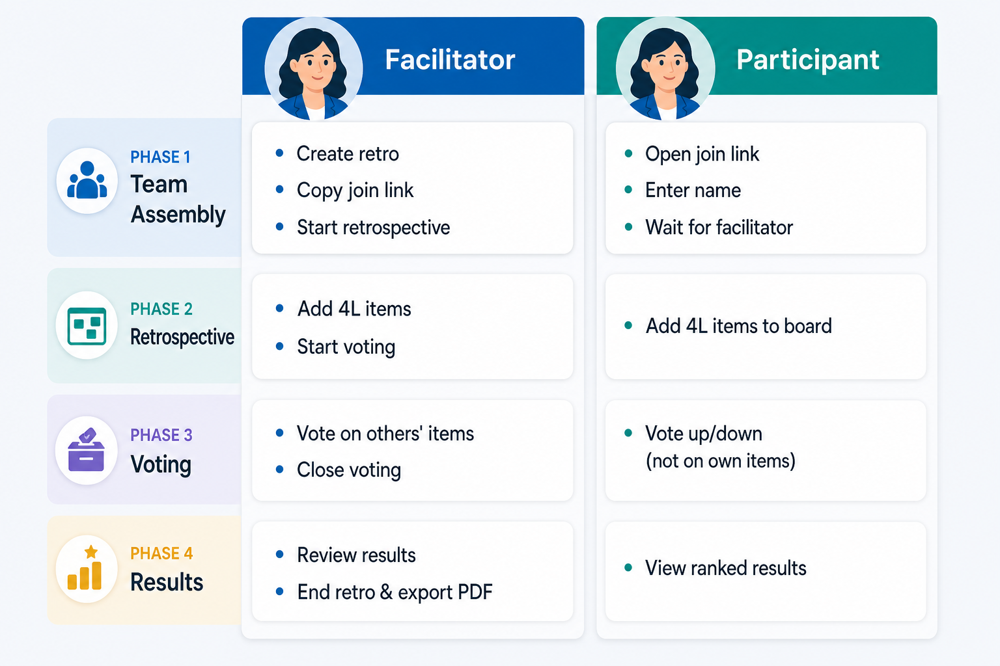

# Scrum Retrospective

Static web app for [scrumretrospective.org](https://scrumretrospective.org) — run lightweight **4 Ls scrum retrospectives** in the browser with no accounts.

## Overview

Facilitators create a session, invite the team via a join link, and guide the retro through four phases: team assembly, item collection, voting, and results. When the facilitator ends the session, results export as a PDF and the room is removed from the sync server.

**4 Ls columns:** Liked · Learned · Lacked · Longed For

**4 Ws columns:** Went Well · Did Not Go Well · Learned · Should Change

**Start, Stop, Continue columns:** Start · Stop · Continue

**Keep, Drop, Try columns:** Keep · Drop · Try

**DAKI columns:** Drop · Add · Keep · Improve

**Mad, Sad, Glad columns:** Mad · Sad · Glad

Facilitators choose a template when creating a retrospective.

## Phases

| Phase | Name | What happens |
|-------|------|----------------|
| 1 | Team assembly | Facilitator creates the retro and shares the join link. Participants join with their name. |
| 2 | Retrospective | Facilitator starts the board. Everyone adds items to any column. |
| 3 | Voting | Facilitator opens voting. Participants vote up/down on **other people's** items. Vote totals stay hidden. |
| 4 | Results | Facilitator closes voting. Items show up/down counts, sorted by net vote in each column. Facilitator can export PDF and end the session. |

## Actors & activities



*Facilitator (left) and participant (right) actions from team assembly through PDF export.*

## Features

- **No accounts** — access via session URL; participant identity stored in `sessionStorage`
- **Live sync** — sync API + 1s polling keeps participants, items, and votes in sync across browsers
- **Presence** — online indicators in the participant sidebar
- **Private voting** — only your own votes are visible during Phase 3; totals appear after close
- **PDF export** — retro name, start/end time, duration, facilitator and participant names, and all items with net votes (columns stacked vertically, sorted by net vote)
- **Ephemeral storage** — in-memory on the sync server; deleted when the facilitator ends the retro

## Development

```bash
npm install
npm run dev
```

This starts **two processes**:

1. **Web app** — [http://localhost:5173](http://localhost:5173)
2. **Sync API** — [http://localhost:8787](http://localhost:8787) (proxied at `/api`)

Join links work across Chrome, Safari, and other browsers on the same machine or network because room data lives on the sync server, not in each browser's `localStorage`.

## Build & deploy

The app splits into two parts:

| Part | Host | Role |
|------|------|------|
| **Static UI** | GitHub Pages | React app at [scrumretrospective.org](https://scrumretrospective.org) |
| **Sync API** | Railway | In-memory room sync (`server/index.mjs`) |

**Production releases are tag-based.** Merging to `main` runs tests only. To deploy, push a semver tag (e.g. `v1.0.0`). The site footer shows that version. See **[docs/RELEASING.md](docs/RELEASING.md)** for the full release process.

Changes land on `main` via **pull request** only (no direct commits to `main`).

### 1. GitHub Pages (static UI)

1. In the repo **Settings → Pages**, set **Source** to **GitHub Actions**.
2. Add a repository variable: **Settings → Secrets and variables → Actions → Variables**
   - Name: `VITE_SYNC_API_URL`
   - Value: your Railway sync API base URL, e.g. `https://your-app.up.railway.app/api`
3. Push a version tag — e.g. `git tag v1.0.0 && git push origin v1.0.0` — the workflow tests, builds with that version in the footer, and deploys `dist/`.

```bash
npm run build
```

A `public/CNAME` file is included for the custom domain `scrumretrospective.org`. Point DNS at GitHub Pages per [GitHub’s custom domain docs](https://docs.github.com/en/pages/configuring-a-custom-domain-for-your-github-pages-site).

### 2. Railway (sync API)

**Option A — Railway dashboard (recommended first time)**

1. Go to [railway.app](https://railway.app) → **New Project** → **Deploy from GitHub repo**.
2. Select `sanjuthomas/scrumretrospective.github.io`.
3. Open the service **Settings**:
   - **Root Directory:** `server`
   - **Start Command:** `node index.mjs` (or leave default if `server/railway.toml` is picked up)
4. **Settings → Networking → Generate Domain** (e.g. `scrum-retro-production.up.railway.app`).
5. Confirm health: `https://YOUR-RAILWAY-DOMAIN/api/health` → `{"ok":true}`.
6. Optional env var **ALLOWED_ORIGINS** — defaults to `https://scrumretrospective.org,https://www.scrumretrospective.org`.

**Option B — GitHub Actions (deploy on version tags)**

1. Railway → your project → **Settings → Tokens** → create a **Project token**.
2. GitHub repo → **Settings → Secrets and variables → Actions → Secrets** → `RAILWAY_TOKEN` = that token.
3. Link the Railway service to this repo (dashboard deploy once), then pushing a version tag (e.g. `v1.0.0`) runs `.github/workflows/railway-sync.yml`.

**Wire the live site to Railway**

1. GitHub repo → **Settings → Secrets and variables → Actions → Variables**:
   - `VITE_SYNC_API_URL` = `https://YOUR-RAILWAY-DOMAIN/api` (must end with `/api`)
2. Push a new version tag (or re-run **Deploy to GitHub Pages** manually with a version label).

Until `VITE_SYNC_API_URL` is set and Pages redeploys, the UI calls `/api` on GitHub Pages and retros will not sync.

**Note:** Room data is in-memory. Redeploying or restarting Railway clears active sessions.

### Local development

```bash
npm install
npm run dev
```

No `VITE_SYNC_API_URL` needed locally — Vite proxies `/api` to `http://localhost:8787`.

Restart the sync API after changing `server/` (a stale local process can still validate only 4 Ls columns).

For a production-like local build:

```bash
VITE_SYNC_API_URL=https://your-app.up.railway.app/api npm run build
npm run preview
```

## Testing

```bash
npm test                 # unit tests (runs in GitHub Actions)
npm run test:watch       # unit tests in watch mode
npm run test:integration # local end-to-end sync API flow
```

Integration tests also run in CI against a local sync API on the GitHub Actions runner (no Railway required).

## Storage model

| Layer | Role |
|-------|------|
| **Sync API** | Source of truth — rooms, participants, cards, votes (in-memory) |
| **Browser cache** | In-memory cache + 1s poll via `subscribeRetro` |
| **sessionStorage** | Current participant ID per retro tab |

Votes are stored server-side during the session. Clients receive aggregated counts only after voting closes (Phase 4).

## API (sync server)

Full reference: **[docs/api.md](docs/api.md)** — request/response shapes, phase rules, templates, errors, and flow.

| Method | Path | Purpose |
|--------|------|---------|
| `GET` | `/api/health` | Health check |
| `GET` | `/api/retrospectives/:id` | Fetch room (optional `?participantId=` for own votes during voting) |
| `PUT` | `/api/retrospectives/:id` | Create/update room (phase transitions) |
| `DELETE` | `/api/retrospectives/:id` | End session (remove room) |
| `POST` | `/api/retrospectives/:id/presence` | Presence heartbeat |
| `POST` | `/api/retrospectives/:id/presence/leave` | Mark participant offline |
| `POST` | `/api/retrospectives/:id/cards` | Add item (Phase 2 only) |
| `POST` | `/api/retrospectives/:id/votes` | Cast vote (Phase 3 only) |

## Routes

| Path | Purpose |
|------|---------|
| `/` | Landing |
| `/initiate` | Facilitator setup form |
| `/retro/:id` | Active session |
| `/join/:id` | Participant join form |
| `/terms` | Terms of Use |
| `/license` | MIT License |

## License & terms

- **Source code:** [MIT License](LICENSE)
- **Hosted service:** [Terms of Use](docs/terms-of-use.md) — as-is, no warranty, no liability; do not submit sensitive or confidential data

## Tech stack

- React 19, TypeScript, Vite, React Router
- Node.js sync API (`server/index.mjs`)
- [jsPDF](https://github.com/parallax/jsPDF) for PDF export
