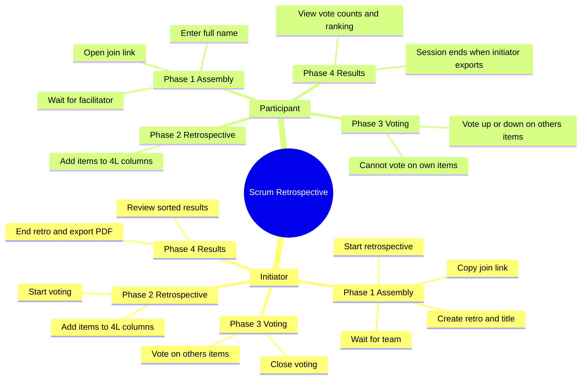

# Scrum Retrospective

Static web app for [scrumretrospective.org](https://scrumretrospective.org) — run lightweight **4Ls scrum retrospectives** in the browser with no accounts.

## Overview

Facilitators create a session, invite the team via a join link, and guide the retro through four phases: team assembly, item collection, voting, and results. When the initiator ends the session, results export as a PDF and the room is removed from the sync server.

**4Ls columns:** Liked · Learned · Lacked · Longed For

## Phases

| Phase | Name | What happens |
|-------|------|----------------|
| 1 | Team assembly | Initiator creates the retro and shares the join link. Participants join with their name. |
| 2 | Retrospective | Initiator starts the board. Everyone adds items to any 4L column. |
| 3 | Voting | Initiator opens voting. Participants vote up/down on **other people's** items. Vote totals stay hidden. |
| 4 | Results | Initiator closes voting. Items show up/down counts, sorted by net vote in each column. Initiator can export PDF and end the session. |

## Actors & activities



## Features

- **No accounts** — access via session URL; participant identity stored in `sessionStorage`
- **Live sync** — sync API + 1s polling keeps participants, items, and votes in sync across browsers
- **Presence** — online indicators in the participant sidebar
- **Private voting** — only your own votes are visible during Phase 3; totals appear after close
- **PDF export** — retro name, initiator, start/end time, duration, participants, and all items (4Ls stacked vertically, sorted by net vote)
- **Ephemeral storage** — in-memory on the sync server; deleted when the initiator ends the retro

## Development

```bash
npm install
npm run dev
```

This starts **two processes**:

1. **Web app** — [http://localhost:5173](http://localhost:5173)
2. **Sync API** — [http://localhost:8787](http://localhost:8787) (proxied at `/api`)

Join links work across Chrome, Safari, and other browsers on the same machine or network because room data lives on the sync server, not in each browser's `localStorage`.

## Build & deploy

```bash
npm run build
```

Deploy the `dist` folder to **GitHub Pages**. A `public/CNAME` file is included for the custom domain `scrumretrospective.org`.

Push to `main` to run the included GitHub Actions workflow, or upload `dist` manually.

### Production sync API

GitHub Pages serves the static UI only. Deploy `server/index.mjs` separately (e.g. Railway, Render, Fly.io) and set `VITE_SYNC_API_URL` at build time to that host's `/api` URL.

## Storage model

| Layer | Role |
|-------|------|
| **Sync API** | Source of truth — rooms, participants, cards, votes (in-memory) |
| **Browser cache** | In-memory cache + 1s poll via `subscribeRetro` |
| **sessionStorage** | Current participant ID per retro tab |

Votes are stored server-side during the session. Clients receive aggregated counts only after voting closes (Phase 4).

## API (sync server)

| Method | Path | Purpose |
|--------|------|---------|
| `GET` | `/api/retrospectives/:id` | Fetch room (optional `?participantId=` for own votes during voting) |
| `PUT` | `/api/retrospectives/:id` | Create/update room (phase transitions) |
| `POST` | `/api/retrospectives/:id/cards` | Add item (Phase 2 only) |
| `POST` | `/api/retrospectives/:id/votes` | Cast vote (Phase 3 only) |
| `POST` | `/api/retrospectives/:id/presence` | Presence heartbeat |
| `DELETE` | `/api/retrospectives/:id` | End session (remove room) |

## Routes

| Path | Purpose |
|------|---------|
| `/` | Landing |
| `/initiate` | Initiator setup form |
| `/retro/:id` | Active session |
| `/join/:id` | Participant join form |

## Tech stack

- React 19, TypeScript, Vite, React Router
- Node.js sync API (`server/index.mjs`)
- [jsPDF](https://github.com/parallax/jsPDF) for PDF export
