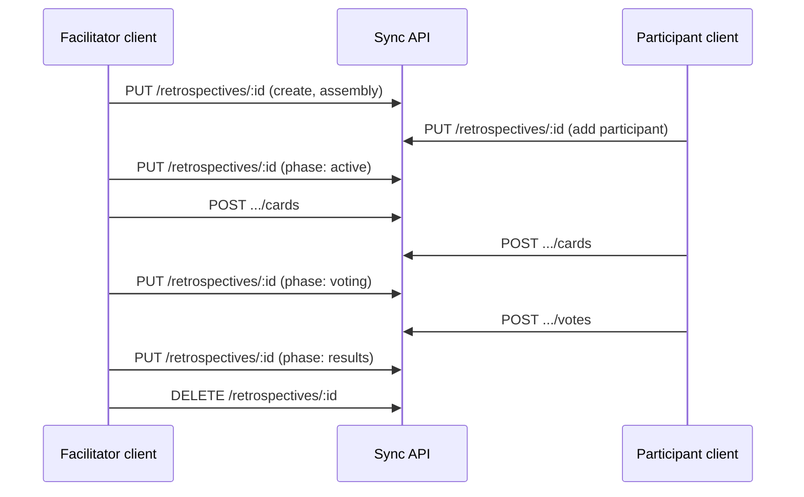

# Sync API reference

HTTP API for real-time retrospective room sync. Implemented in [`server/index.mjs`](../server/index.mjs).

| Environment | Base URL |
|-------------|----------|
| Production (Railway) | `https://scrumretrospectivegithubio-production.up.railway.app/api` |
| Local dev (Vite proxy) | `http://localhost:5173/api` → `http://localhost:8787` |

All paths below are relative to the base URL (e.g. `GET /retrospectives/:id` → `GET {base}/retrospectives/:id`).

## Overview

- **9 endpoints** — health, room CRUD, presence, cards, votes, facilitator transfer
- **JSON** request and response bodies (`Content-Type: application/json`)
- **No authentication** — room IDs are unguessable UUIDs; the app stores participant identity in `sessionStorage`
- **In-memory storage** — rooms disappear on server restart or `DELETE`
- **CORS** — browser clients from allowed origins only (see [CORS](#cors))

## CORS

| Setting | Default |
|---------|---------|
| `ALLOWED_ORIGINS` env var | `https://scrumretrospective.org,https://www.scrumretrospective.org` |

Allowed methods: `GET`, `PUT`, `POST`, `DELETE`, `OPTIONS`.

Preflight: `OPTIONS` any path → `204 No Content` with CORS headers.

## Data model

### `Retrospective` (room)

| Field | Type | Notes |
|-------|------|-------|
| `id` | `string` | UUID; must match URL on `PUT` |
| `name` | `string` | Display name |
| `createdAt` | `number` | Unix ms timestamp |
| `template` | `"fourLs"` \| `"fourWs"` \| `"startStopContinue"` \| `"keepDropTry"` \| `"daki"` \| `"madSadGlad"` | Defaults to `"fourLs"` on create; preserved on update if omitted |
| `phase` | `"assembly"` \| `"active"` \| `"voting"` \| `"results"` | Defaults to `"assembly"` |
| `participants` | `Participant[]` | Required on `PUT` |
| `cards` | `RetroCard[]` | Board items; optional on `PUT` (server merges with existing) |
| `myVotes` | `Record<string, "up" \| "down">` | **Response only** — present when `?participantId=` is set and `phase` is `voting` |
| `cardVoteCounts` | `Record<string, { up: number; down: number }>` | **Response only** — present when `phase` is `results` |

Votes are stored server-side but **never** returned in full. Clients only receive `myVotes` (own votes during voting) or `cardVoteCounts` (aggregates after close).

### `Participant`

| Field | Type | Notes |
|-------|------|-------|
| `id` | `string` | UUID |
| `fullName` | `string` | |
| `isFacilitator` | `boolean` | Legacy `isInitiator: true` is normalized to `isFacilitator` |
| `joinedAt` | `number` | Unix ms |
| `online` | `boolean` | **Response only** — derived from presence heartbeats (12s timeout) |

Do not send `online` or `lastSeen` from the client on `PUT`; the server tracks `lastSeen` internally.

### `RetroCard`

| Field | Type |
|-------|------|
| `id` | `string` |
| `column` | Column id (see [Templates](#templates)) |
| `text` | `string` |
| `authorId` | `string` (participant id) |
| `createdAt` | `number` |

### Phases

| Phase | Meaning |
|-------|---------|
| `assembly` | Team joining; board locked |
| `active` | Items can be added |
| `voting` | Votes can be cast; adding items blocked |
| `results` | Vote totals visible; voting closed |

#### Allowed phase transitions (`PUT`)

Forward-only; invalid jumps return `403`:

```
assembly → active → voting → results
```

| Attempted transition | Error |
|----------------------|-------|
| `assembly` → `voting` | `Start the retrospective before opening voting` |
| `voting` → `active` | `Cannot return to retrospective phase` |
| `*` → `results` (not from `voting` or `results`) | `Close voting before viewing results` |
| `results` → `voting` | `Voting is already closed` |
| `results` → `active` | `Cannot return to retrospective phase` |

### Templates

| `template` | Valid `column` values |
|------------|----------------------|
| `fourLs` | `liked`, `learned`, `lacked`, `longedFor` |
| `fourWs` | `wentWell`, `didNotGoWell`, `learned`, `shouldChange` |
| `startStopContinue` | `start`, `stop`, `continue` |
| `keepDropTry` | `keep`, `drop`, `try` |
| `daki` | `drop`, `add`, `keep`, `improve` |
| `madSadGlad` | `mad`, `sad`, `glad` |

Wrong column for the room template → `400 Invalid column`.

## Error responses

Unless noted, errors use:

```json
{ "error": "Human-readable message" }
```

| Status | Meaning |
|--------|---------|
| `400` | Bad request / invalid JSON / validation |
| `403` | Forbidden (phase, permissions, self-vote) |
| `404` | Room, participant, or card not found |
| `405` | HTTP method not allowed |
| `500` | Unhandled server error (rare) |

Success wrappers:

```json
{ "ok": true }
```

---

## Endpoints

### `GET /health`

Liveness check (Railway health probe).

**Response `200`**

```json
{ "ok": true }
```

---

### `GET /retrospectives/:id`

Fetch current room state.

**Query**

| Param | Required | Description |
|-------|----------|-------------|
| `participantId` | No | When set and `phase` is `voting`, response includes `myVotes` for that participant |

**Response `200`** — `Retrospective` (client-enriched; see [Data model](#data-model))

**Response `404`**

```json
{ "error": "Not found" }
```

---

### `PUT /retrospectives/:id`

Create a new room or update an existing one. Used for joining participants and phase changes.

**Request body** — full `Retrospective` payload:

- `id` must match `:id` in the URL
- Omit `myVotes` and `cardVoteCounts` (server-derived)
- Omit `votes` (server-managed; stripped if sent)
- `template` optional on update — if omitted, server keeps the existing template
- `participants` without `online` / `lastSeen`

**Create example**

```http
PUT /retrospectives/550e8400-e29b-41d4-a716-446655440000
Content-Type: application/json

{
  "id": "550e8400-e29b-41d4-a716-446655440000",
  "name": "Sprint 42 Retro",
  "createdAt": 1717593600000,
  "template": "fourLs",
  "phase": "assembly",
  "cards": [],
  "participants": [
    {
      "id": "facilitator-uuid",
      "fullName": "Jane Doe",
      "isFacilitator": true,
      "joinedAt": 1717593600000
    }
  ]
}
```

**Response `200`** — updated `Retrospective`

**Response `400`**

```json
{ "error": "Invalid retrospective payload" }
```

```json
{ "error": "Invalid JSON" }
```

**Response `403`** — invalid phase transition (see [Phases](#phases))

---

### `DELETE /retrospectives/:id`

Remove a room (facilitator ends session).

**Response `200`**

```json
{ "ok": true }
```

**Response `404`**

```json
{ "error": "Not found" }
```

---

### `POST /retrospectives/:id/presence`

Presence heartbeat. Call periodically (~every few seconds) while a participant is on the session page.

**Request body**

```json
{
  "participantId": "participant-uuid"
}
```

**Response `200`**

```json
{ "ok": true }
```

**Response `400`** — missing `participantId` or invalid JSON

**Response `404`**

```json
{ "error": "Participant not found" }
```

---

### `POST /retrospectives/:id/presence/leave`

Mark a participant offline (`lastSeen` cleared). Used on tab close via `sendBeacon`.

**Request body**

```json
{
  "participantId": "participant-uuid"
}
```

**Response `200`**

```json
{ "ok": true }
```

**Response `400`** — missing `participantId` or invalid JSON

Room may not exist; still returns `200` (no-op).

---

### `POST /retrospectives/:id/cards`

Add a board item. **Only when `phase` is `active`.**

**Request body**

```json
{
  "participantId": "participant-uuid",
  "column": "liked",
  "text": "Shipped on time"
}
```

| Field | Rules |
|-------|-------|
| `participantId` | Must be a room participant |
| `column` | Must match room `template` |
| `text` | Non-empty after trim |

**Response `200`** — full `Retrospective` including the new card

**Response `400`**

```json
{ "error": "participantId, column, and text are required" }
```

```json
{ "error": "Invalid column" }
```

**Response `403`**

```json
{ "error": "Retrospective has not started yet" }
```

```json
{ "error": "Adding items is closed during voting" }
```

```json
{ "error": "Participant not found" }
```

**Response `404`**

```json
{ "error": "Not found" }
```

---

### `POST /retrospectives/:id/votes`

Cast or change a vote. **Only when `phase` is `voting`.**

**Request body**

```json
{
  "participantId": "participant-uuid",
  "cardId": "card-uuid",
  "value": "up"
}
```

| Field | Rules |
|-------|-------|
| `value` | `"up"` or `"down"` |
| `cardId` | Must exist; cannot be authored by `participantId` |

**Toggle behavior:** posting the same `value` again **removes** the vote.

**Response `200`** — full `Retrospective` with `myVotes` for the voter (no `cardVoteCounts` until results)

**Response `400`**

```json
{ "error": "participantId, cardId, and value are required" }
```

```json
{ "error": "Invalid vote value" }
```

**Response `403`**

```json
{ "error": "Voting is not open yet" }
```

```json
{ "error": "You cannot vote on your own item" }
```

```json
{ "error": "Participant not found" }
```

**Response `404`**

```json
{ "error": "Not found" }
```

```json
{ "error": "Card not found" }
```

---

### `POST /retrospectives/:id/facilitator/transfer`

Transfer the facilitator role to another participant (similar to making someone else the meeting host).

**Request body**

```json
{
  "fromParticipantId": "current-facilitator-uuid",
  "toParticipantId": "new-facilitator-uuid"
}
```

| Field | Rules |
|-------|-------|
| `fromParticipantId` | Must be the current facilitator |
| `toParticipantId` | Must be a different participant in the room |

Allowed in any phase while the room exists.

**Response `200`** — updated `Retrospective` with exactly one `isFacilitator: true` participant

**Response `400`**

```json
{ "error": "fromParticipantId and toParticipantId are required" }
```

```json
{ "error": "Cannot transfer facilitator role to yourself" }
```

**Response `403`**

```json
{ "error": "Only the facilitator can transfer the role" }
```

**Response `404`**

```json
{ "error": "Not found" }
```

```json
{ "error": "Participant not found" }
```

`PUT` updates preserve each existing participant's facilitator flag; use this endpoint to change it.

---

## Typical flow



1. Facilitator **creates** room with `PUT` (`phase: assembly`).
2. Participants **join** via another `PUT` (append to `participants`).
3. Facilitator **starts** retro: `PUT` with `phase: active`.
4. Anyone adds items: `POST .../cards`.
5. Facilitator opens voting: `PUT` with `phase: voting`.
6. Participants vote: `POST .../votes` (poll `GET` with `participantId` for own votes).
7. Facilitator closes voting: `PUT` with `phase: results` (`cardVoteCounts` appear).
8. Facilitator ends session: `DELETE`.

Clients also send `POST .../presence` on an interval and `POST .../presence/leave` when leaving.

## Client implementation

The browser app wraps these endpoints in [`src/lib/retroApi.ts`](../src/lib/retroApi.ts). Integration tests in [`tests/integration/retro-flow.test.ts`](../tests/integration/retro-flow.test.ts) exercise the full flow against a local server instance.
